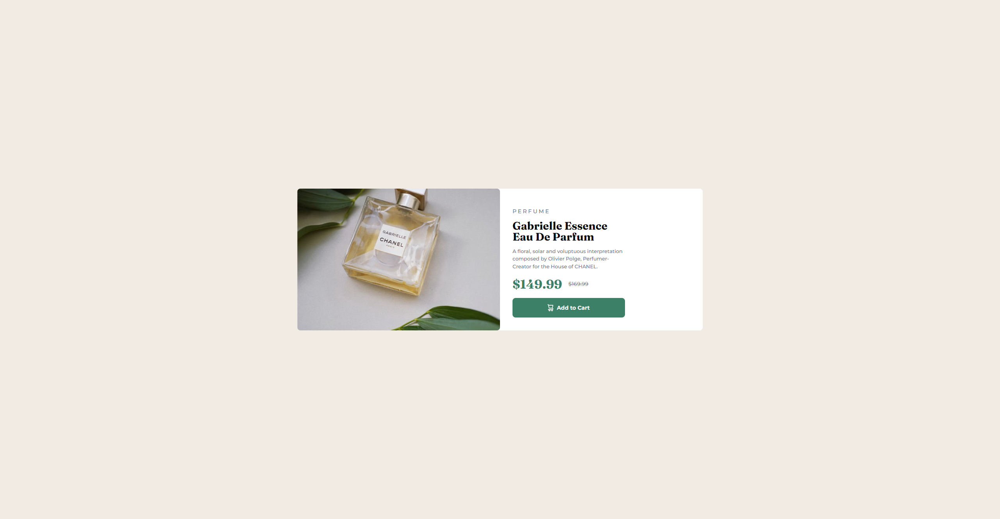

# Frontend Mentor - Product preview card component solution

This is a solution to the [Product preview card component challenge on Frontend Mentor](https://www.frontendmentor.io/challenges/product-preview-card-component-GO7UmttRfa). Frontend Mentor challenges help you improve your coding skills by building realistic projects.

### Screenshot

### Links

- Solution URL: [Github Repo](https://github.com/HelloImAron/product-preview-card-component-main)
- Live Site URL: [Live Github Page](https://helloimaron.github.io/product-preview-card-component-main/)

### Built with

- HTML5
- SASS

### What I learned

I've successfully learned that I need to practise A LOT of responsive design, and figure out a better way to build the skeleton(html) of a page.

## Author

- [Github](https://github.com/HelloImAron)
- [Frontend Mentor](https://www.frontendmentor.io/profile/HelloImAron)
